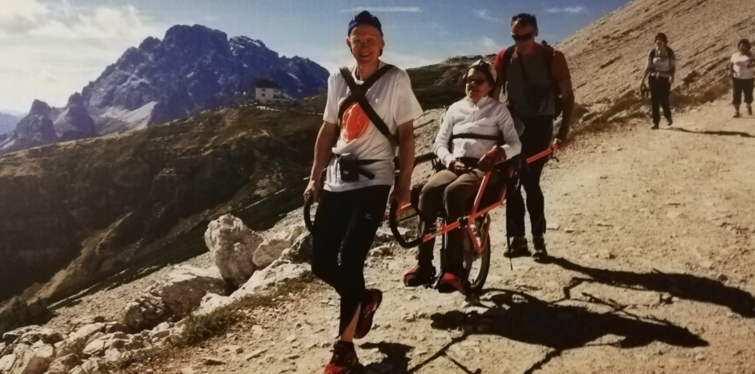

.. _h636a35023286e551161312a6f284231:

Minchia... le Dolomiti! 
########################

\ |LINK1|\  & powered by \ |LINK2|\ . Uno dei territori più incantevoli d'Italia per montagne, valli, fiumi e laghi. Un viaggio che prende ispirazione dalla mappa cartacea \ |LINK3|\  delle Dolomiti\ [#F1]_\ , ricevuta nel giugno 2016 all'incontro \ |LINK4|\ , e dal mantra di Andrea "\ |STYLE0|\ " per l'ammirazione verso questi luoghi.

\ |IMG1|\ 

.. toctree:: 
    :maxdepth: 2
    :caption: contenuti 

    index

.. _h726d306f2568651c95a3776f54d65:

Itinerario seguito a lug-ago 2018 da Ciro, Antonio  & families
**************************************************************

\ |STYLE1|\  \ |LINK5|\ \ |STYLE2|\  \ |LINK6|\ \ |STYLE3|\ 

* \ |LINK7|\  (possibilità di fare bagni in estate)

* \ |LINK8|\  (possibilità di fare bagni in estate)

* \ |LINK9|\  

* \ |LINK10|\  (passo più alto della Marmolada percorribile in auto)

* \ |LINK11|\  (escursione facile su asfalto nella gola di una valle)

* Albergo Malga Ciapela - \ |LINK12|\   (trekking medio con forti salite all'andata)

* Valle Ansiei (\ |LINK13|\  casa colonica, base dei pernottamenti, struttura altamente specializzata per persone con disabilità)

* \ |LINK14|\ 

* \ |LINK15|\  nella Valle di Ansiei (trekking facili per famiglie con bambini)

* \ |LINK16|\  (trekking lungo per famiglie con bambini, 5-6 ore)

* \ |LINK17|\  e montagne sopra il lago (trekking lunghi possibili e discesa a piedi dopo la salita in seggiovia)

* \ |LINK18|\  e montagne sopra il lago (trekking lunghi possibili e discesa a piedi dopo la salita in seggiovia)

* \ |LINK19|\  (trekking facili per famiglie con bambini)

|

.. _h761e1a5c35378502048d62350c1c:

L'abilità delle Dolomiti
************************

La struttura di \ |LINK20|\ , sulla Valle di Ansiei (lat. 46.532798, long. 12.290340), è dotata di strumenti atti ad ospitare persone con disabilità fisiche e psichiche. Sono disponibili anche carrozzelle particolari per far fruire pienamente i sentieri montani. 

\ |IMG2|\ \ |IMG3|\ 
 

\ |STYLE4|\ . Questa struttura rende un angolo delle Dolomiti fruibile e godibile da tante persone con difficoltà motorie anche grazie alla valida rete di volontari che si dedicano con passione a questa attività di supporto e aiuto ai disabili. Il popolo delle Dolomiti è un esempio di elevata civiltà e solidarietà.

|

.. _h413233a6a34415b4c236492a442446:

Escursioni possibili nei dintorni di Trento e di Auronzo di Cadore
******************************************************************

Grazie a Francesca Gleria e Maurizio Napolitano per alcuni suggerimenti. \ |LINK21|\ 

|REPLACE1|

|

.. _h4f5842425422497ae193155e5d56:

Il Trentino dei bambini e delle famiglie
****************************************

* \ |LINK22|\  

* \ |LINK23|\   (\ |STYLE5|\ ) 

* \ |LINK24|\  (\ |STYLE6|\ )

* \ |LINK25|\  (\ |STYLE7|\ )

* \ |LINK26|\  (\ |STYLE8|\ )

* \ |LINK27|\  (\ |STYLE9|\ )

|

..  Note:: 

    I contenuti di questa pagina sono editati su Google Doc e tramite il plugin GGeditor (tutorial = \ |LINK28|\ ) vengono esposti automaticamente su \ |LINK29|\ , comodamente consultabile su smartphone, molto utile in viaggio.

.. bottom of content

.. |STYLE0| replace:: **minchia… le Dolomiti!**

.. |STYLE1| replace:: **Le foto (di**

.. |STYLE2| replace:: **) dei luoghi visitati durante gli itinerari sono disponibili in**

.. |STYLE3| replace:: **.**

.. |STYLE4| replace:: *Foto a cura della struttura di Villa Gregoriana*

.. |STYLE5| replace:: **laghi**

.. |STYLE6| replace:: **mappa con eventi di interesse per le famiglie in Trentino**

.. |STYLE7| replace:: **appuntamenti sul territorio**

.. |STYLE8| replace:: **zaino porta bimbi**

.. |STYLE9| replace:: **affitto zaino porta bimbi**

.. |REPLACE1| raw:: html

    <iframe src="https://www.google.com/maps/d/u/1/embed?mid=1P6jmsZXotve0fjtP98fpE_jsokZuaCD0" width="740" height="580"></iframe>

.. |LINK1| raw:: html

    <a href="https://twitter.com/search?f=tweets&q=%23minchialedolomiti" target="_blank">Citazione di Andrea Borruso</a>

.. |LINK2| raw:: html

    <a href="https://twitter.com/napo" target="_blank">Napo</a>

.. |LINK3| raw:: html

    <a href="http://dolomiti.webmapp.it/" target="_blank">webMapp</a>

.. |LINK4| raw:: html

    <a href="http://www.portobeseno.it/blog/?p=7340" target="_blank">"mappe e beni collettivi (digitali)", di Portobeseno</a>

.. |LINK5| raw:: html

    <a href="https://cirospat.readthedocs.io" target="_blank">Ciro Spataro</a>

.. |LINK6| raw:: html

    <a href="https://www.flickr.com/photos/cirospat/albums/72157670138461937" target="_blank">questo album di Flickr</a>

.. |LINK7| raw:: html

    <a href="https://it.wikipedia.org/wiki/Lago_di_Levico" target="_blank">Lago di Levico</a>

.. |LINK8| raw:: html

    <a href="https://it.wikipedia.org/wiki/Lago_di_Tovel" target="_blank">Lago Tovel</a>

.. |LINK9| raw:: html

    <a href="https://www.google.it/maps/place/38030+Fontanazzo+TN/@46.4795713,11.7182473,5854m/data=!3m1!1e3!4m5!3m4!1s0x47786bcbe33b35d1:0x806915256787ff96!8m2!3d46.4705052!4d11.7287705" target="_blank">Fontanazzo</a>

.. |LINK10| raw:: html

    <a href="https://www.google.it/maps/place/Lago+di+Fedaia/@46.4563857,11.8675874,4843m/data=!3m1!1e3!4m5!3m4!1s0x47784148229089d9:0x42b5e7b17c12fccb!8m2!3d46.4590973!4d11.8702524" target="_blank">Lago di Fedaia</a>

.. |LINK11| raw:: html

    <a href="https://www.google.it/maps/place/Serrai+di+Sottoguda/@46.4262502,11.9190216,1250m/data=!3m1!1e3!4m5!3m4!1s0x477845dc90242471:0x929365ca27bf62e1!8m2!3d46.4245487!4d11.9322996" target="_blank">Serrai di Sottoguda</a>

.. |LINK12| raw:: html

    <a href="https://www.google.it/maps/place/Malga+Ombretta/@46.4246801,11.875269,3325m/data=!3m1!1e3!4m5!3m4!1s0x4778441202a66c3d:0x9ccf8a23b37e66cd!8m2!3d46.4245603!4d11.8808392" target="_blank">Malga Ombretta</a>

.. |LINK13| raw:: html

    <a href="https://www.google.it/maps/place/Villa+Gregoriana/@46.5326107,12.2880333,518m/data=!3m2!1e3!4b1!4m5!3m4!1s0x4779cb9591c39c73:0xe7c361622eb5eac2!8m2!3d46.532607!4d12.290222" target="_blank">Villa Gregoriana</a>

.. |LINK14| raw:: html

    <a href="https://www.google.it/maps/place/Malga+Maraia/@46.557728,12.2704087,5836m/data=!3m1!1e3!4m5!3m4!1s0x4779cb61258ee163:0xbccedd3305c93190!8m2!3d46.550747!4d12.2855667" target="_blank">Malga Maraia</a>

.. |LINK15| raw:: html

    <a href="https://www.google.it/maps/place/Parco+Naturale+Somadida/@46.533469,12.2482712,5198m/data=!3m1!1e3!4m5!3m4!1s0x4779cb0bd47df807:0x36510ab659a8164f!8m2!3d46.5301389!4d12.2645144" target="_blank">Parco Somadida</a>

.. |LINK16| raw:: html

    <a href="https://www.google.it/maps/place/Tre+Cime+di+Lavaredo/@46.6192094,12.2908286,2476m/data=!3m1!1e3!4m5!3m4!1s0x477832ab852dd7bf:0x1c6dd1d90b67e9e!8m2!3d46.6186777!4d12.3027679" target="_blank">Tre cime di Lavaredo</a>

.. |LINK17| raw:: html

    <a href="https://www.google.it/maps/place/Lago+di+Misurina/@46.5825624,12.2505231,1697m/data=!3m1!1e3!4m5!3m4!1s0x4779ccc5ace48d17:0xbdeb91ec0d7d90f9!8m2!3d46.5825777!4d12.254444" target="_blank">Lago di Misurina</a>

.. |LINK18| raw:: html

    <a href="https://www.google.it/maps/place/Lago+di+Auronzo/@46.5414899,12.4324468,6791m/data=!3m1!1e3!4m5!3m4!1s0x4779c5e876ad7fd9:0xbb8924cd7763adc1!8m2!3d46.543986!4d12.450793" target="_blank">Lago di Auronzo</a>

.. |LINK19| raw:: html

    <a href="https://www.google.it/maps/place/Val+Visdende/@46.626186,12.6032558,5949m/data=!3m1!1e3!4m5!3m4!1s0x4779dd10631807d9:0x8d44fc47f3e3e80a!8m2!3d46.6195641!4d12.6286142" target="_blank">Val Visdende</a>

.. |LINK20| raw:: html

    <a href="http://www.accoglienza.diocesi.it/strutture/villa-gregoriana/home" target="_blank">Villa Gregoriana</a>

.. |LINK21| raw:: html

    <a href="https://www.google.com/maps/d/u/1/edit?mid=1P6jmsZXotve0fjtP98fpE_jsokZuaCD0&ll=46.04223529100524%2C11.031806791015697&z=9" target="_blank">Mappa personalizzata con tappe, costruita su Google Maps</a>

.. |LINK22| raw:: html

    <a href="http://www.iltrentinodeibambini.it" target="_blank">http://www.iltrentinodeibambini.it</a>

.. |LINK23| raw:: html

    <a href="http://www.iltrentinodeibambini.it/category/allaria-aperta/al-lago" target="_blank">http://www.iltrentinodeibambini.it/category/allaria-aperta/al-lago</a>

.. |LINK24| raw:: html

    <a href="https://estatefamily.it/" target="_blank">https://estatefamily.it</a>

.. |LINK25| raw:: html

    <a href="https://www.trentinofamiglia.it/News-eventi/Appuntamenti-sul-territorio" target="_blank">https://www.trentinofamiglia.it/News-eventi/Appuntamenti-sul-territorio</a>

.. |LINK26| raw:: html

    <a href="https://iviaggideirospi.com/2016/09/come-scegliere-lo-zaino-porta-bimbo-consigli.html" target="_blank">https://iviaggideirospi.com/2016/09/come-scegliere-lo-zaino-porta-bimbo-consigli.html</a>

.. |LINK27| raw:: html

    <a href="https://www.snowservice.it/estate/" target="_blank">https://www.snowservice.it/estate/</a>

.. |LINK28| raw:: html

    <a href="https://googledocs.readthedocs.io" target="_blank">https://googledocs.readthedocs.io</a>

.. |LINK29| raw:: html

    <a href="https://minchia-le-dolomiti.readthedocs.io" target="_blank">minchia-le-dolomiti.readthedocs.io</a>

.. rubric:: Footnotes

.. [#f1]  Mappa Panoramica delle Dolomiti, di Marco Barbieri. La mappa è stata realizzata utilizzando open-data geografici di varia provenienza, prodotti dal progetto OpenStreetMap e dalle pubbliche amministrazioni. Per la rappresentazione cartografica è stata utilizzata una particolare proiezione geografica, la proiezione ortografica obliqua. Il risultato è una vista simil panoramica, particolarmente realistica di tutti i gruppi dolomitici. La Mappa Panoramica delle Dolomiti è stata finanziata attraverso una campagna di crowd-funding.

.. |IMG1| image:: static/Dolomiti-index_1.png
   :height: 281 px
   :width: 601 px

