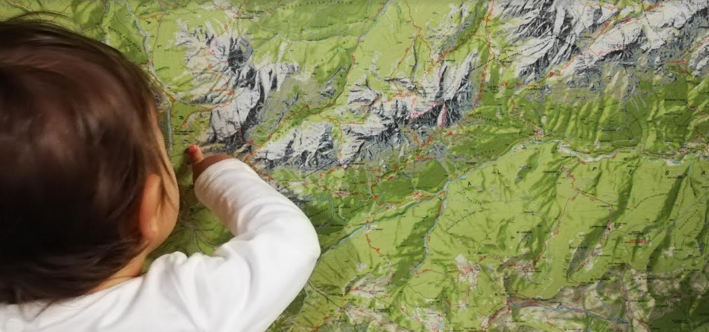

.. toctree:: 
    :maxdepth: 2
    :caption: contenuti 

    index

.. _h636a35023286e551161312a6f284231:

Minchia... le Dolomiti! 
########################

\ |LINK1|\  & powered by \ |LINK2|\ . Uno dei territori più incantevoli d'Italia.

\ |IMG1|\ 

.. _h2644201e575623d2f271f4f2d69716e:

Itinerario seguito a lug-ago 2018 da Ciro & family, Antonio & family
********************************************************************

Le foto (di \ |LINK3|\ ) degli itinerari sono disponibili in \ |LINK4|\ .

* \ |LINK5|\  (bagni in estate)

* \ |LINK6|\  (bagni in estate)

* \ |LINK7|\  

* \ |LINK8|\  (passo più alto della Marmolada percorribile in auto)

* \ |LINK9|\  (escursione facile su asfalto nella gola di una valle)

* Albergo Malga Ciapela - \ |LINK10|\   (trekking medio)

* Valle Ansiei (\ |LINK11|\  casa colonica)

* \ |LINK12|\ 

* \ |LINK13|\  nella Valle di Ansiei (trekking facili)

* Tre cime di Lavaredo (trekking lungo, 5-6 ore)

* \ |LINK14|\  e montagne sopra il lago (trekking lunghi possibili e discesa a piedi dopo la salita in seggiovia)

* \ |LINK15|\  e montagne sopra il lago (trekking lunghi possibili e discesa a piedi dopo la salita in seggiovia)

* \ |LINK16|\  (trekking facili)

|

.. _h5d67431d1854a6719455c77372d7f61:

Escursioni possibili nei dintorni di Trento e Auronzo di Cadore
***************************************************************

[Grazie a Francesca Gleria e Maurizio Napolitano per alcuni suggerimenti]

\ |LINK17|\ 

|REPLACE1|

|

.. _h4f5842425422497ae193155e5d56:

Il Trentino dei bambini e delle famiglie
****************************************

* \ |LINK18|\  

* \ |LINK19|\   (laghi) 

* \ |LINK20|\  (mappa con eventi di interesse per le famiglie in Trentino)

* \ |LINK21|\  (appuntamenti sul territorio)

|

.. _h394b229397045b7c7973f28107079:

Lo zaino porta bimbi
********************

* \ |LINK22|\  

* \ |LINK23|\  affitto zaino

|

..  Note:: 

    [I contenuti di questa pagina sono editati su Google Doc e tramite il plugin GGeditor (tutorial = \ |LINK24|\ ) vengono esposti automaticamente sul link \ |LINK25|\ , comodamente consultabile su smartphone, molto utile in viaggio]

.. bottom of content

.. |REPLACE1| raw:: html

    <iframe src="https://www.google.com/maps/d/u/1/embed?mid=1P6jmsZXotve0fjtP98fpE_jsokZuaCD0" width="740" height="580"></iframe>

.. |LINK1| raw:: html

    <a href="https://twitter.com/search?f=tweets&q=%23minchialedolomiti" target="_blank">Cit. Andrea Borruso</a>

.. |LINK2| raw:: html

    <a href="https://twitter.com/napo" target="_blank">Napo</a>

.. |LINK3| raw:: html

    <a href="https://cirospat.readthedocs.io" target="_blank">Ciro Spataro</a>

.. |LINK4| raw:: html

    <a href="https://www.flickr.com/photos/cirospat/albums/72157670138461937" target="_blank">questo album di Flickr</a>

.. |LINK5| raw:: html

    <a href="https://it.wikipedia.org/wiki/Lago_di_Levico" target="_blank">Lago di Levico</a>

.. |LINK6| raw:: html

    <a href="https://it.wikipedia.org/wiki/Lago_di_Tovel" target="_blank">Lago Tovel</a>

.. |LINK7| raw:: html

    <a href="https://www.google.it/maps/place/38030+Fontanazzo+TN/@46.4795713,11.7182473,5854m/data=!3m1!1e3!4m5!3m4!1s0x47786bcbe33b35d1:0x806915256787ff96!8m2!3d46.4705052!4d11.7287705" target="_blank">Fontanazzo</a>

.. |LINK8| raw:: html

    <a href="https://www.google.it/maps/place/Lago+di+Fedaia/@46.4563857,11.8675874,4843m/data=!3m1!1e3!4m5!3m4!1s0x47784148229089d9:0x42b5e7b17c12fccb!8m2!3d46.4590973!4d11.8702524" target="_blank">Lago di Fedaia</a>

.. |LINK9| raw:: html

    <a href="https://www.google.it/maps/place/Serrai+di+Sottoguda/@46.4262502,11.9190216,1250m/data=!3m1!1e3!4m5!3m4!1s0x477845dc90242471:0x929365ca27bf62e1!8m2!3d46.4245487!4d11.9322996" target="_blank">Serrai di Sottoguda</a>

.. |LINK10| raw:: html

    <a href="https://www.google.it/maps/place/Malga+Ombretta/@46.4246801,11.875269,3325m/data=!3m1!1e3!4m5!3m4!1s0x4778441202a66c3d:0x9ccf8a23b37e66cd!8m2!3d46.4245603!4d11.8808392" target="_blank">Malga Ombretta</a>

.. |LINK11| raw:: html

    <a href="https://www.google.it/maps/place/Villa+Gregoriana/@46.5326107,12.2880333,518m/data=!3m2!1e3!4b1!4m5!3m4!1s0x4779cb9591c39c73:0xe7c361622eb5eac2!8m2!3d46.532607!4d12.290222" target="_blank">Villa Gregoriana</a>

.. |LINK12| raw:: html

    <a href="https://www.google.it/maps/place/Malga+Maraia/@46.557728,12.2704087,5836m/data=!3m1!1e3!4m5!3m4!1s0x4779cb61258ee163:0xbccedd3305c93190!8m2!3d46.550747!4d12.2855667" target="_blank">Malga Maraia</a>

.. |LINK13| raw:: html

    <a href="https://www.google.it/maps/place/Parco+Naturale+Somadida/@46.533469,12.2482712,5198m/data=!3m1!1e3!4m5!3m4!1s0x4779cb0bd47df807:0x36510ab659a8164f!8m2!3d46.5301389!4d12.2645144" target="_blank">Parco Somadida</a>

.. |LINK14| raw:: html

    <a href="https://www.google.it/maps/place/Lago+di+Misurina/@46.5825624,12.2505231,1697m/data=!3m1!1e3!4m5!3m4!1s0x4779ccc5ace48d17:0xbdeb91ec0d7d90f9!8m2!3d46.5825777!4d12.254444" target="_blank">Lago di Misurina</a>

.. |LINK15| raw:: html

    <a href="https://www.google.it/maps/place/Lago+di+Auronzo/@46.5414899,12.4324468,6791m/data=!3m1!1e3!4m5!3m4!1s0x4779c5e876ad7fd9:0xbb8924cd7763adc1!8m2!3d46.543986!4d12.450793" target="_blank">Lago di Auronzo</a>

.. |LINK16| raw:: html

    <a href="https://www.google.it/maps/place/Val+Visdende/@46.626186,12.6032558,5949m/data=!3m1!1e3!4m5!3m4!1s0x4779dd10631807d9:0x8d44fc47f3e3e80a!8m2!3d46.6195641!4d12.6286142" target="_blank">Val Visdende</a>

.. |LINK17| raw:: html

    <a href="https://www.google.com/maps/d/u/1/edit?mid=1P6jmsZXotve0fjtP98fpE_jsokZuaCD0&ll=46.04223529100524%2C11.031806791015697&z=9" target="_blank">Mappa personalizzata con tappe costruita su Google Maps</a>

.. |LINK18| raw:: html

    <a href="http://www.iltrentinodeibambini.it" target="_blank">http://www.iltrentinodeibambini.it</a>

.. |LINK19| raw:: html

    <a href="http://www.iltrentinodeibambini.it/category/allaria-aperta/al-lago" target="_blank">http://www.iltrentinodeibambini.it/category/allaria-aperta/al-lago</a>

.. |LINK20| raw:: html

    <a href="https://estatefamily.it/" target="_blank">https://estatefamily.it</a>

.. |LINK21| raw:: html

    <a href="https://www.trentinofamiglia.it/News-eventi/Appuntamenti-sul-territorio" target="_blank">https://www.trentinofamiglia.it/News-eventi/Appuntamenti-sul-territorio</a>

.. |LINK22| raw:: html

    <a href="https://iviaggideirospi.com/2016/09/come-scegliere-lo-zaino-porta-bimbo-consigli.html" target="_blank">https://iviaggideirospi.com/2016/09/come-scegliere-lo-zaino-porta-bimbo-consigli.html</a>

.. |LINK23| raw:: html

    <a href="https://www.snowservice.it/estate/" target="_blank">https://www.snowservice.it/estate/</a>

.. |LINK24| raw:: html

    <a href="https://googledocs.readthedocs.io" target="_blank">https://googledocs.readthedocs.io</a>

.. |LINK25| raw:: html

    <a href="http://dolomiti2018.readthedocs.io" target="_blank">dolomiti2018.readthedocs.io</a>

